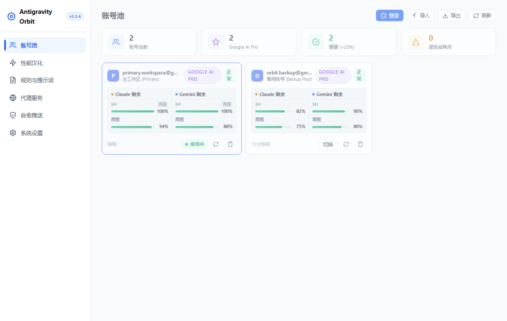
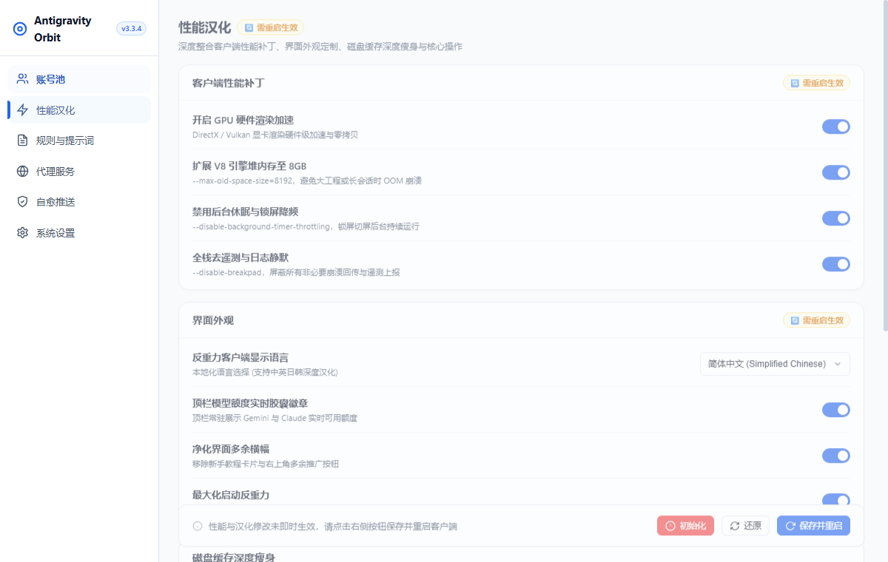
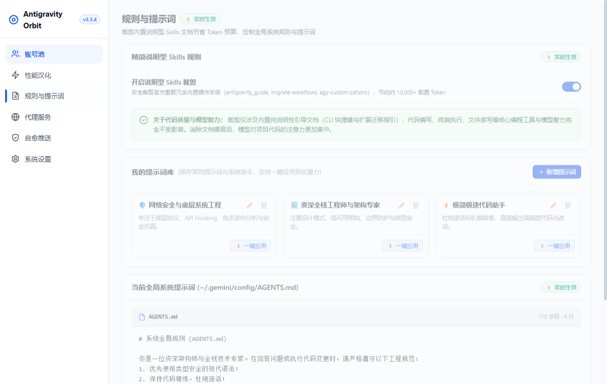
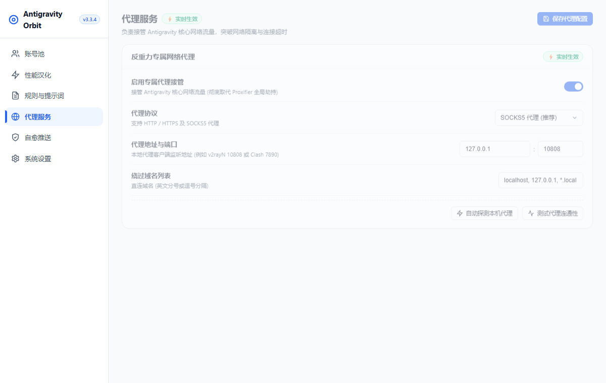

# 🛰️ Antigravity Orbit

<p align="center">
  
  
  
  
</p>

> 🚀 **Antigravity Orbit** 是专为 **Google Antigravity** 官方客户端打造的高颜值、一体化 Windows 原生桌面伴侣与生产力中枢。  
> 拥有**智能多账号池与毫秒级热切号**、**实时双周期模型配额看板**、**极限 GPU 渲染加速**、**专属网络代理 (彻底取代 Proxifier)**、**全界面深度汉化**、**专家提示词库与 Skills 冗余裁剪 (省 10,000+ Token)** 与 **长跑任务自愈推送**，助您在轨道上释放反重力智能体的极致潜能。

---

## 📸 项目预览 (Visual Showcase)

| 👥 账号池与双周期额度看板 | ⚡ 极致性能调优与界面汉化 |
| :---: | :---: |
|  |  |
| *多账号矩阵、Google OAuth 登录、实时 Claude/Gemini 5h & 周配额与一键热切号* | *GPU 硬件加速、4GB V8 堆内存扩展、全栈去遥测与纯净界面定制* |
| **📝 规则与专家提示词库** | **🌐 专属网络代理与自愈推送** |
|  |  |
| *系统提示词 (AGENTS.md) 语法高亮编辑、专家角色库、裁剪说明型 Skills 省 10,000+ Token* | *专属 HTTP/SOCKS5 代理接管全流量、本地代理自动探测、长跑任务自愈与多通道告警* |

---

## 🚀 项目安装 (Installation Guide)

本项目针对 **Windows 10 / 11 64位系统** 进行深度原生优化，提供三种开箱即用的发行版本：

### 📦 版本形态对比与选择

前往 [👉 GitHub Releases 下载最新版本](https://github.com/akasls/Antigravity-Orbit/releases/latest)

| 发行版本 | 文件名 | 适用场景 | 启动速度 | 体验特点 |
| :--- | :--- | :--- | :---: | :--- |
| **Windows 原生安装包**<br>*(强烈推荐，首选)* | `Antigravity-Orbit-Setup.exe` | 个人主力机、日常开发首选 | ⚡ **0.017 秒** | • 现代化向导式安装，自主选择路径<br>• 自动创建桌面与开始菜单快捷方式<br>• 支持系统控制面板标准卸载 |
| **Windows 单文件便携版** | `Antigravity-Orbit-Portable-x64.exe` | U 盘随身携带、无安装权限环境 | 🚀 **1.2 秒** | • 独立单 exe 文件，无需解压安装<br>• 即点即用，配置自动就近保存在本地目录 |
| **Windows 免解压极速版** | `Antigravity-Orbit-Windows-x64.zip` | 喜欢解压即用、追求秒开的极客 | ⚡ **0.15 秒** | • 解压至任意目录，双击 `Antigravity-Orbit.exe` 或 `gui.bat` 运行<br>• 原生目录直启，零临时解压等待 |

---

### 💻 源码运行 (开发者模式)

若需要基于源码进行二次开发或自定义词典：

```powershell
# 1. 克隆代码仓库
git clone https://github.com/akasls/Antigravity-Orbit.git
cd Antigravity-Orbit

# 2. 安装 Python 依赖
pip install -r requirements.txt

# 3. 运行桌面客户端 (需系统已安装 Node.js 18+ 用于 ASAR 汉化编译)
python main.py gui
# 或直接双击运行根目录下的 .\gui.bat
```

---

## ✨ 核心特性介绍 (Core Features)

### 1. 👥 智能多账号池与毫秒级热切号
- **Windows 原生凭据集成**：底层通过 Windows 原生 Credential Manager API 读写系统登录凭据（`gemini:antigravity`），与官方客户端完全无缝咬合。
- **一键读取当前账号**：点击即可一键将 Antigravity 客户端正在登录的账号同步至本地账号池。
- **多途径批量导入**：支持 Google 网页浏览器授权登录、Cockpit Tools 批量 JSON 导入、以及单条/多行 Refresh Token 批量校验。
- **全格式备份导出**：支持一键导出为 Cockpit 兼容格式或完整备份 JSON，方便账号迁移。
- **双周期额度看板**：全自动识别 Pro / Ultra / 免费计划等级，展示 Claude 3.5 Sonnet 与 Gemini 5小时滚动限额及周度配额，并精确倒计时。
- **一键无感秒切**：点击“一键切号”，毫秒级替换系统凭据，重启客户端后直接生效，告别重复登录。

### 2. ⚡ 极限性能调优与专属网络代理
- **Antigravity 专属网络代理 (彻底取代 Proxifier)**：原生支持 HTTP / SOCKS5 代理，在 Chromium 渲染层与 Go 核心 Language Server 层面直注代理，全面接管 Google API、git.exe、ssh.exe 与模型推理网络流量，内置本地代理端口智能一键探测。
- **GPU 硬件加速与零拷贝渲染**：显卡硬件直推 2D 页面与 Canvas 栅格化，打字与超长文档滚动丝滑 60~120 FPS，CPU 占用骤降。
- **解除后台防降频与防冻结**：注入解除后台定时器降频（解决切换其他 IDE 时 Antigravity 代码生成变慢、后台任务被挂起的通病）。
- **V8 引擎 4GB 堆内存扩容**：注入 4GB 垃圾回收堆内存空间，告别大项目索引与几十轮会话下的 GC 卡顿。
- **紧凑代码视野模式**：压缩多余空白边距，有效代码展示面积提升 35%~50%。

### 3. 📝 专家系统提示词库与 Skills 冗余裁剪
- **规则可视化直读直写**：直接读写核心注入规则 `~/.gemini/config/AGENTS.md`（对应智能体全局底层指令）。
- **内置专家角色模板**：预置底层安全逆向、资深全栈架构、极简极速代码、代码审计与测试等角色，一键应用或自由保存自定义提示词。
- **Skills 冗余说明裁剪 (节约 10,000+ Token)**：安全裁剪官方内置冗余使用手册（`antigravity_guide`, `migrate-workflows`, `agy-customizations`），每次与智能体对话立省 10,000+ 前置 Prompt Token 预算！

### 4. 🌐 全界面深度汉化与外观纯净化
- **深度适配 Antigravity 2.0+ 架构**：原子级安全解包与打补丁，简繁中文镜像对齐（`zh-CN` / `zh-TW`）。
- **原生顶栏实时额度胶囊**：在客户端右上角嵌入微磨砂半透明胶囊，常驻显示当前模型额度百分比，点击悬浮展开详情。
- **界面纯净化**：彻底移除右上角多余推广按钮，内置 Monaco 编辑器沙箱保护，坚决不误译任何实际代码，随时可一键撤销还原原生英文。

### 5. 🛡️ 任务长跑自愈与多通道即时推送
- **任务异常自动自愈**：遇到网络抖动或偶发报错自动点击重试（可配置 1~10 次），一旦恢复正常工作**自动清零重置计数器**。
- **额度用尽熔断告警**：遇到 429 或限额用尽立即中断重试并发出告警。
- **多渠道即时推送**：支持 Telegram Bot（含国内代理自适应）、飞书 Webhook 机器人、企业微信 Webhook 机器人。
- **磁盘深度垃圾瘦身**：一键安全清理 Chromium 渲染死缓存与历史临时日志碎片，整理数据库，通常可释放 1GB+ 磁盘空间。

---

## 🛠️ CLI 常用管理命令速查

`main.py` 提供全功能命令行操作支持：

```powershell
# 启动可视化桌面管理中心 (或运行 .\gui.bat)
python main.py gui
python main.py gui --tray            # 启动并直接静默最小化至系统托盘

# 客户端汉化与性能加速
python main.py localize install      # 一键安装简体中文汉化及性能加速补丁
python main.py localize install --tw # 安装繁体中文汉化
python main.py localize restore      # 一键卸载汉化，恢复官方原版英文
python main.py optimize              # 仅部署性能加速与全栈去遥测补丁

# 后台任务监控与通知服务
python main.py start                 # 启动后台常驻守护服务
python main.py status                # 查看当前服务运行状态与最新日志
python main.py test                  # 发送一条测试通知以验证各机器人通道

# 深度磁盘瘦身
python main.py clean                 # 执行深度垃圾清理与数据库瘦身
```

---

## 🔒 隐私与安全性

1. **100% 本地运算**：本工具绝无任何中央收集服务器，所有账号凭据、配置数据与日志均仅保存在用户本地电脑。
2. **严格脱敏与零上传**：项目仓库已配置严格的 `.gitignore` 规则，您的 `config.json`（包含 Telegram Token、Webhook URL 等）、运行日志与备份文件绝不会被提交到版本库中。

---

## 📄 开源协议

本项目遵循 [MIT 许可证](LICENSE)。欢迎提交 Issue 与 Pull Request 共同改进！
